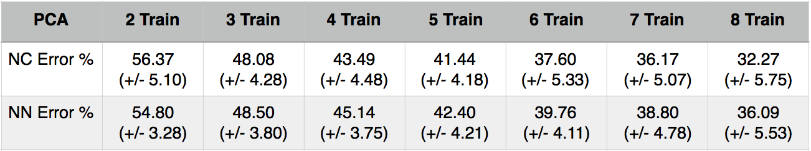

# Eigenface method for face recognition
I implemented eigenface approach by using a famous Yale face dataset. This dataset contains 165 grayscale images of 15 individuals. There are 11 images per subject, one per different facial expression or configuration: center-light, w/glasses, happy, left-light, w/no glasses, normal, right-light, sad, sleepy, surprised, and wink [3]. I picked up a random subset with p=(2,3,4,5,6,7,8) which each subset contains 50 splits. In each split contains training indexes and testing indexes. I also select K eigenvectors for each subset: 27 for p=2, 43 for p=3, 59 for p=4, 70 for p=5, 80 for p=6, 90 for p=7, 95 for p=8.

# Paper
[1]. M. Turk and A. Pentland, "Eigenfaces for Recognition", Journal of Cognitive Neuroscience, vol. 3, no. 1, pp. 71-86, 1991
[2]. Eigenfaces for Face Detection/Recognition : http://www.vision.jhu.edu/teaching/vision08/Handouts/case_study_pca1.pdf

# Face Dataset
http://www.cad.zju.edu.cn/home/dengcai/Data/FaceData.html

# Result

# Note
This is part of my homework in Ankara University (2016-2017)
